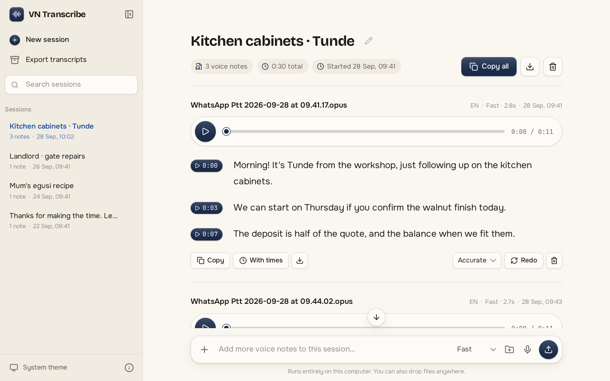
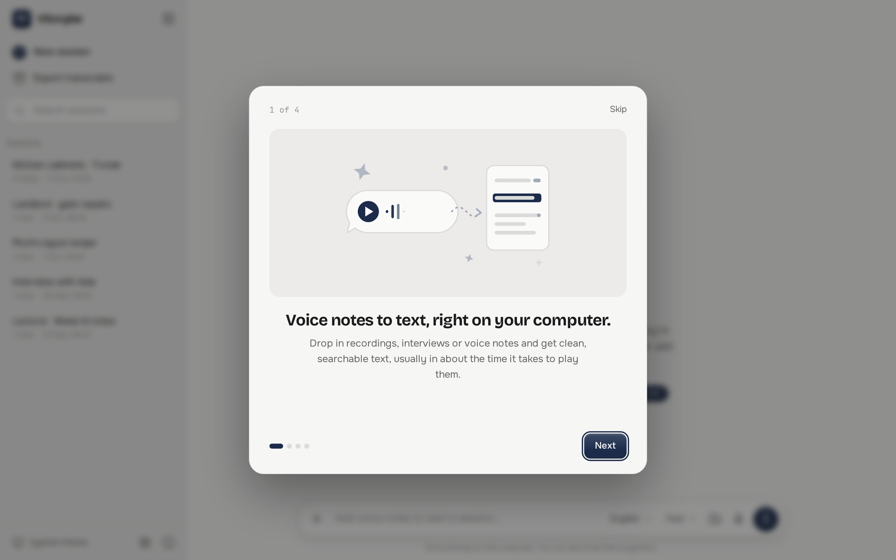

# vScribe

[](https://github.com/Invalid8/vscribe/actions/workflows/ci.yml)

Convert audio and voice notes to text you can copy, search and export, without uploading them anywhere. Transcription runs on your own computer with OpenAI's open Whisper models.

<picture>
  <source media="(prefers-color-scheme: dark)" srcset="docs/screenshots/session-dark.png">
  
</picture>

## Features

- **Private.** Audio and transcripts never leave your computer. After a one-time model download it works offline.
- **Any recording.** Opens `.opus`, `.ogg`, `.m4a`, `.mp3`, `.wav`, `.amr`, `.aac`, `.webm` and more.
- **Sessions.** Every batch of notes becomes a thread you can rename, search, add to and delete.
- **Many ways in.** Pick files, convert a whole folder, drag and drop, or record from your microphone.
- **Listen along.** Each line has a timestamp; click it to hear that exact moment.
- **Get the text out.** Copy one note or the whole session, with or without times, or export everything as a zip.
- **Your language.** English by default; pick another language next to the model when your notes aren't in English.
- **Two models.** *Fast* (Whisper small) suits most voice notes; *Accurate* (large-v3-turbo) is better with heavy
  accents and noise.
- **Command line too.** `vscribe transcribe` writes a `.txt` next to every voice note in a folder.

## Install

### Linux (Ubuntu, Debian, Mint, Pop!_OS)

Download the latest `vscribe_<version>_amd64.deb` from
[Releases](https://github.com/Invalid8/vscribe/releases), then:

```sh
sudo apt install ./vscribe_*_amd64.deb
```

Open **vScribe** from your app menu. The first time you transcribe, it downloads the Fast model (about 480 MB).

Uninstall with `sudo apt remove vscribe`. Your sessions stay in `~/.local/share/vscribe` until you delete
that folder.

### Windows 10 and 11

Download `vScribe_<version>_x64-setup.exe` from [Releases](https://github.com/Invalid8/vscribe/releases) and run it.
The installer isn't code-signed yet, so Windows may show "Windows protected your PC": choose **More info → Run
anyway**. Uninstall from **Settings → Apps**.

### macOS 11 or later

Download the `.dmg` for your Mac from [Releases](https://github.com/Invalid8/vscribe/releases):

- `vScribe_<version>_aarch64.dmg` for Apple silicon (M1 and later)
- `vScribe_<version>_x64.dmg` for Intel Macs

Open it and drag **vScribe** into Applications. The app isn't notarized by Apple yet, so the first launch is
blocked: open **System Settings → Privacy & Security**, scroll down and click **Open Anyway** next to vScribe.

To build from source, see [CONTRIBUTING.md](CONTRIBUTING.md).

## Command line

The `.deb` installs a `vscribe` command. On macOS it is `/Applications/vScribe.app/Contents/MacOS/vscribe`, and on
Windows `vscribe.exe` in vScribe's install folder.

```sh
vscribe transcribe ~/Recordings/                     # writes a .txt next to each voice note
vscribe transcribe note.opus --stdout                    # print instead of writing a file
vscribe transcribe note.opus -t                          # [m:ss] timestamps on every line
vscribe transcribe interview.m4a -m large-v3-turbo       # the Accurate model
vscribe transcribe note.opus -l fr                       # a language other than English
```

Files that already have a `.txt` are skipped unless you pass `--force`.

## Where things are kept

| What | Linux | macOS | Windows |
| --- | --- | --- | --- |
| Sessions, audio copies, transcripts | `~/.local/share/vscribe` | `~/Library/Application Support/vscribe` | `%APPDATA%\vscribe` |
| Downloaded models | `~/.cache/vscribe/models` | `~/Library/Caches/vscribe/models` | `%LOCALAPPDATA%\vscribe\models` |
| Log file | `~/.local/state/vscribe/log/vscribe.log` | `~/Library/Caches/vscribe/log/vscribe.log` | `%LOCALAPPDATA%\vscribe\log\vscribe.log` |

Your original files are never changed or moved. Deleting a session deletes its copies.

## How it works

vScribe is a single Rust program built with [Tauri](https://tauri.app). It runs a small web server on a
private local port (axum + MiniJinja templates, with an htmx + Alpine.js interface) and shows it in a native window.
Audio is decoded with FFmpeg built into the app and transcribed with
[CTranslate2](https://github.com/OpenNMT/CTranslate2), the same engine faster-whisper uses. Nothing listens on the
network.



## Contributing

Bug reports and pull requests are welcome. See [CONTRIBUTING.md](CONTRIBUTING.md) for setup, tests and how to build
the desktop app. Found a problem but don't use GitHub? Use **About → Report an issue** in the app.

## License

[MIT](LICENSE). vScribe bundles and downloads third-party software and models under their own licenses; see
[THIRD_PARTY_NOTICES.md](THIRD_PARTY_NOTICES.md).
